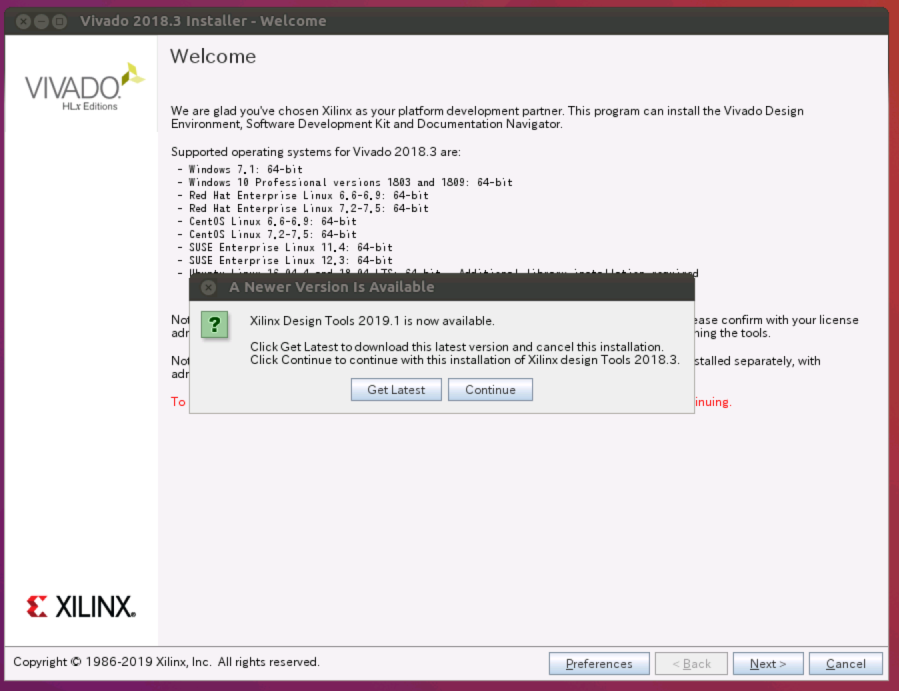
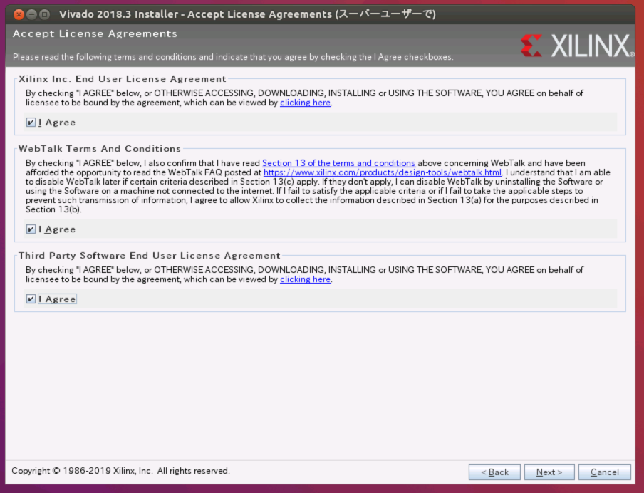
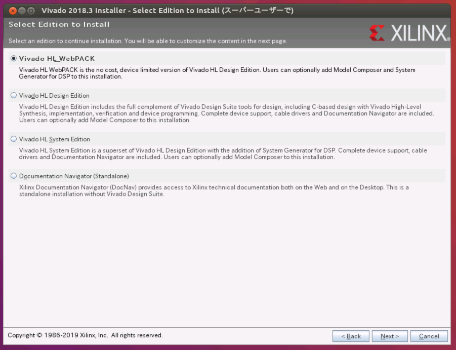
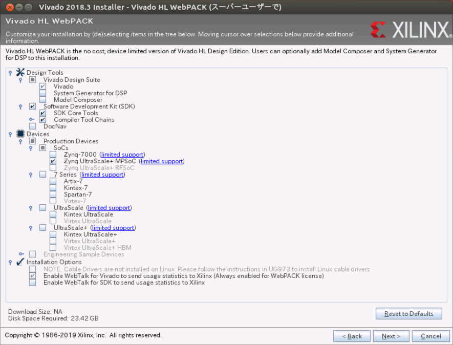
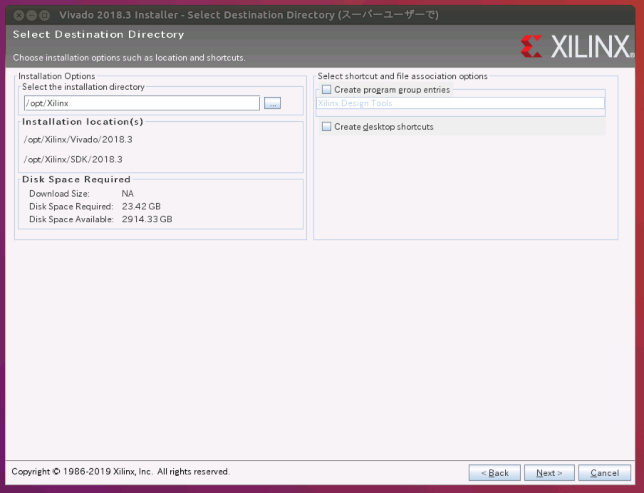
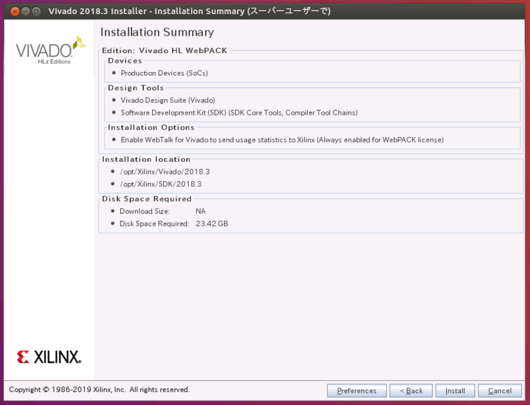
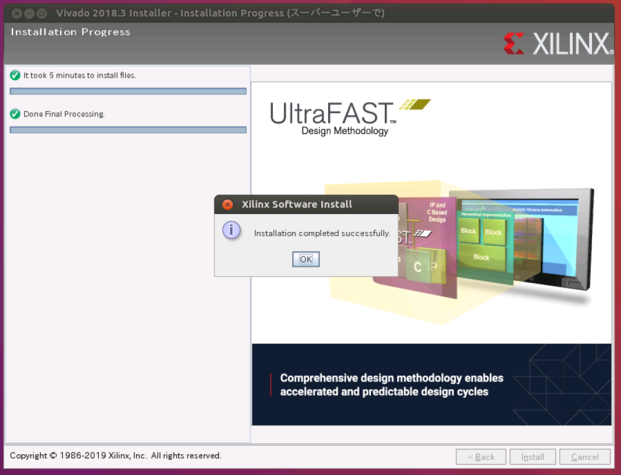

# Vivadov
Vivado Webpackインストール済みDocker Imageを作成する
# Vivado Webpackのインストール
<https://japan.xilinx.com/member/forms/download/xef-vivado.html?filename=Xilinx_Vivado_SDK_2018.3_1207_2324.tar.gz>
    $ tar -zxvf  Xilinx_Vivado_SDK_2018.3_1207_2324.tar.gz
    $ cd Xilinx_Vivado_SDK_2018.3_1207_2324
    $ sudo -E ./xsetup
GUIが立ち上がるので、下記の通り進める。

