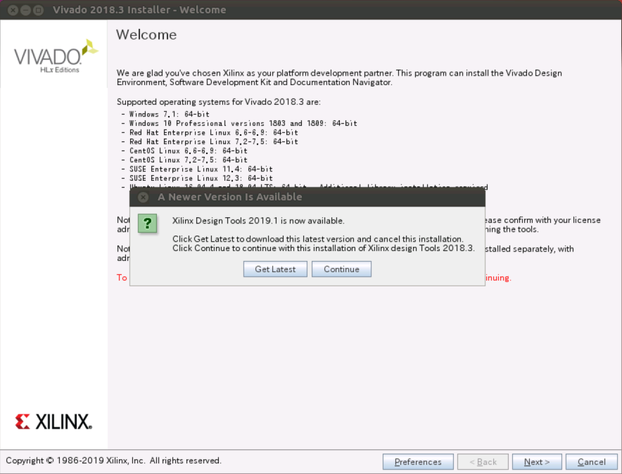
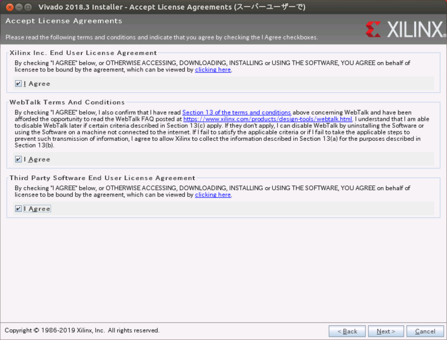
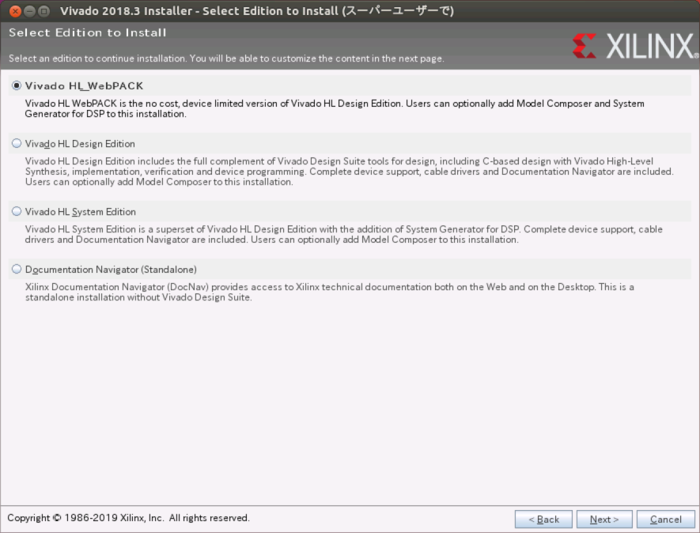
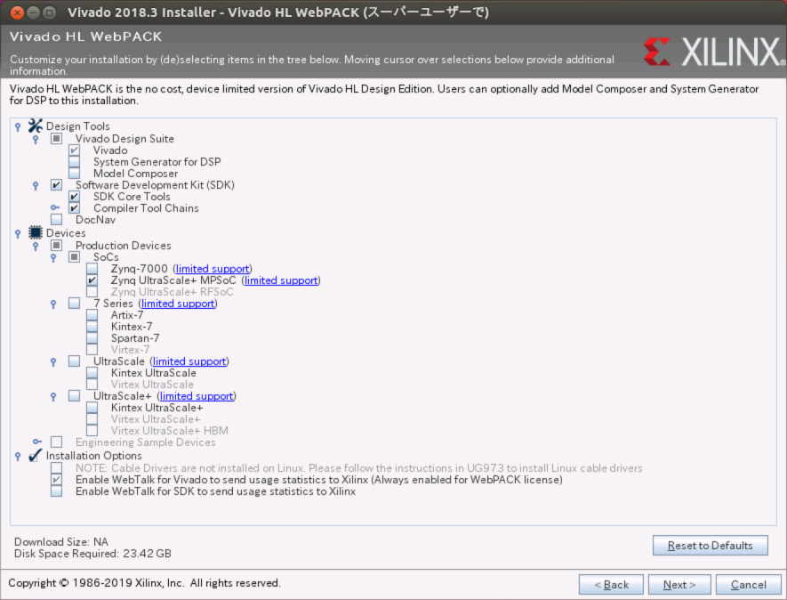
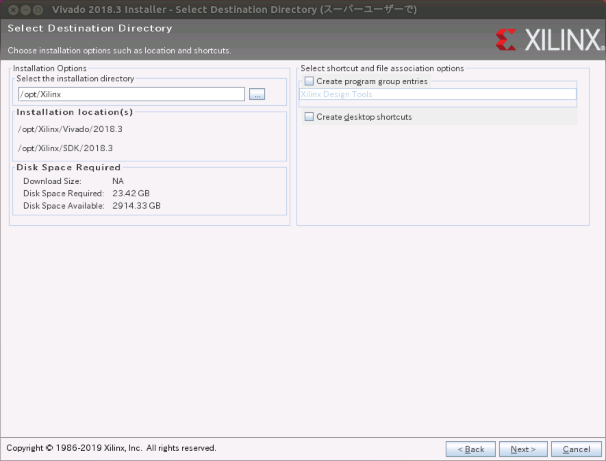
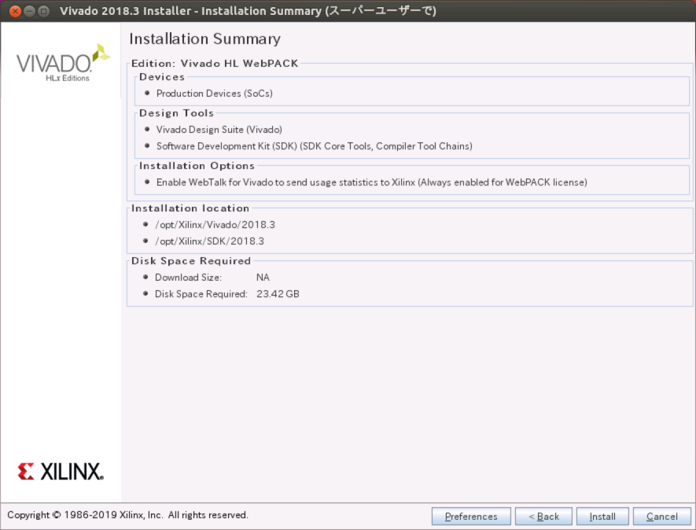
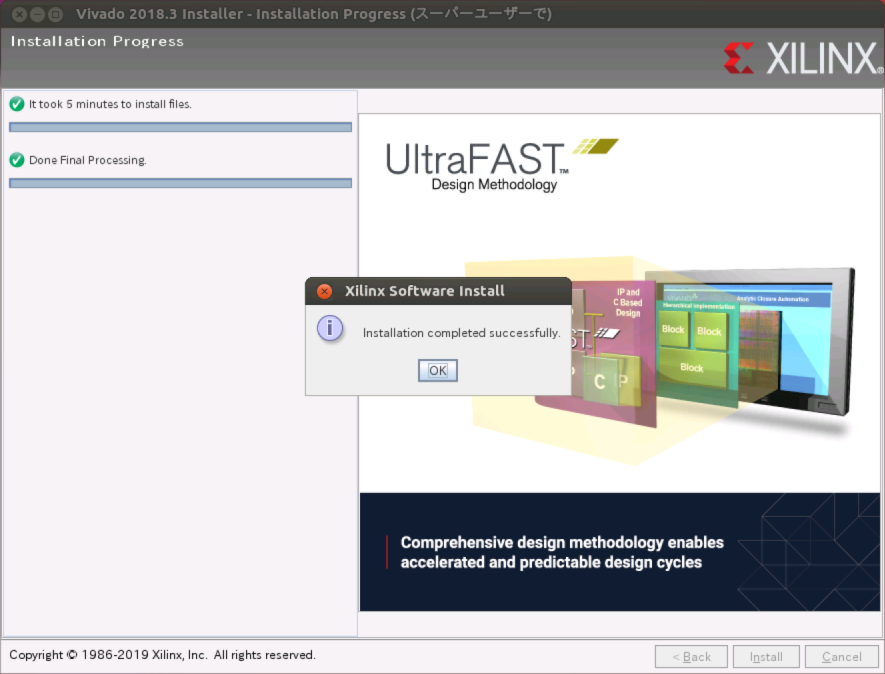

# Vivado Docker Image作成手順
Vivado Webpackインストール済みDocker Imageを作成する
## Vivado Webpackのインストール
まずはHostコンピュータにVivado Webpackをインストールする。

1. インストーラを
<https://japan.xilinx.com/member/forms/download/xef-vivado.html?filename=Xilinx_Vivado_SDK_2018.3_1207_2324.tar.gz>
からダウンロード

2. ダウンロードしたファイルを解凍し、root権限でxsetupを実行
```
$ tar -zxvf Xilinx_Vivado_SDK_2018.3_1207_2324.tar.gz
$ cd Xilinx_Vivado_SDK_2018.3_1207_2324
$ export http_proxy=http://g3.konicaminolta.jp:8080/
$ export https_proxy=http://g3.konicaminolta.jp:8080/
$ sudo -E ./xsetup
```

3. GUIが立ち上がるので、下記の通り進める。


別バージョンを勧められるが無視して`Continue`をクリックし、`Next>`をクリック。


`I Agree`をすべてチェックし、`Next>`をクリック。


`Vivado HL WebPACK`をチェックし、`Next>`をクリック。


画面の通りにチェックし、`Next>`をクリック。  
(インストールサイズを減らすため、最低限の選択)


`Select the installation directory`は`/opt/Xilinx`を入力し、`Next>`をクリック。  
（コンテナ内のパスに合わせるため、必ずこのパスを指定すること）


`Next>`をクリック。


しばらくすると、インストールが終了し、上記画面となる。

## Ultra96 Board File追加
1. Avnetのgitリポジトリからファイルを取得
```
$ git clone https://github.com/Avnet/bdf.git
```
2. Webkitのインストールディレクトリにコピー
```
$ cd bdf
$ cp -Rdp ultra96* /opt/Xilinx/Vivado/2018.3/data/boards/board_files/
```

## Docker Image作成
1. 本ディレクトリに移動し、Webkitのインストールディレクトリを丸ごとtarで固めて圧縮
```
$ cd docker/vivado
$ tar -C /opt -zcvf Xilinx_Webpack_2018_3.tgz Xilinx
```

2. Docker Imageを作成する
```
$ ./build_docker.sh
```
